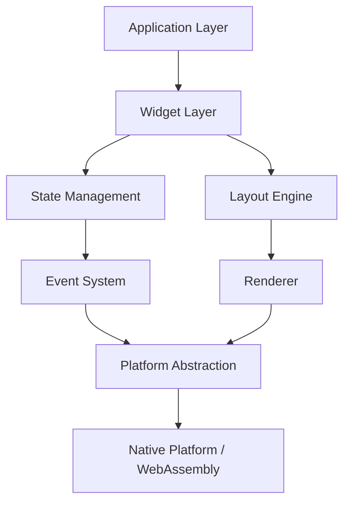

# OxideUI Technical Specification

## 1. Executive Summary

OxideUI is a next-generation, lightweight, secure, and reactive UI framework written in pure Rust. It combines the declarative programming model of Flutter/React with Rust's performance and safety guarantees, targeting desktop applications, web prototypes via WebAssembly, and future mobile platforms.

### Core Values
- **Performance First**: GPU-accelerated rendering with minimal CPU overhead
- **Memory Safety**: Zero-cost abstractions and compile-time guarantees
- **Developer Experience**: Declarative API with hot-reload capabilities
- **Cross-Platform**: Single codebase for desktop, web, and future mobile targets

## 2. Architecture Design

### 2.1 Multi-Crate Workspace Structure

```
oxide-ui/
├── Cargo.toml                 # Workspace root
├── crates/
│   ├── oxide-core/            # Core functionality
│   │   ├── Cargo.toml
│   │   └── src/
│   │       ├── state.rs       # State management
│   │       ├── event.rs       # Event system
│   │       ├── layout.rs      # Layout engine
│   │       └── lib.rs
│   │
│   ├── oxide-renderer/        # GPU rendering
│   │   ├── Cargo.toml
│   │   └── src/
│   │       ├── gpu.rs         # wgpu integration
│   │       ├── pipeline.rs    # Render pipeline
│   │       ├── text.rs        # Text rendering
│   │       └── lib.rs
│   │
│   ├── oxide-widgets/         # UI components
│   │   ├── Cargo.toml
│   │   └── src/
│   │       ├── button.rs
│   │       ├── text_input.rs
│   │       ├── container.rs
│   │       └── lib.rs
│   │
│   ├── oxide-platform/        # Platform abstraction
│   │   ├── Cargo.toml
│   │   └── src/
│   │       ├── desktop.rs     # Desktop implementation
│   │       ├── web.rs         # WASM implementation
│   │       └── lib.rs
│   │
│   └── oxide-macros/          # Procedural macros
│       ├── Cargo.toml
│       └── src/
│           └── lib.rs
│
├── examples/
│   ├── hello_world/
│   ├── todo_app/
│   └── calculator/
│
├── docs/
│   ├── architecture/
│   ├── api/
│   └── tutorials/
│
└── tests/
    ├── integration/
    └── benchmarks/
```

### 2.2 Architectural Layers



### 2.3 Component Interaction Patterns

#### State Flow
- **Unidirectional Data Flow**: State changes flow from top to bottom
- **Reactive Updates**: Components automatically re-render on state changes
- **Immutable State**: All state modifications create new state instances

#### Rendering Pipeline
1. **Widget Tree Construction**: Declarative UI description
2. **Layout Calculation**: Flexbox-based constraint solving
3. **GPU Command Generation**: Convert to draw calls
4. **Frame Presentation**: Platform-specific surface presentation

## 3. Technical Stack Specification

### 3.1 Core Dependencies

```toml
[workspace.dependencies]
# Core
tokio = { version = "1.40", features = ["rt-multi-thread", "macros"] }
futures = "0.3"
thiserror = "1.0"
anyhow = "1.0"

# State Management
arc-swap = "1.7"
dashmap = "6.0"
parking_lot = "0.12"

# Serialization
serde = { version = "1.0", features = ["derive"] }
serde_json = "1.0"
bincode = "1.3"

# Renderer
wgpu = "0.20"
lyon = "1.0"
cosmic-text = "0.12"
image = "0.25"

# Platform
winit = "0.29"
raw-window-handle = "0.6"

# Web
wasm-bindgen = "0.2"
web-sys = "0.3"
js-sys = "0.3"

# Development
tracing = "0.1"
tracing-subscriber = "0.3"
criterion = "0.5"
```

### 3.2 Core Module (`oxide-core`)

#### State Management System
```rust
// Reactive state with signals
pub trait Signal<T> {
    fn get(&self) -> &T;
    fn set(&mut self, value: T);
    fn subscribe(&self, callback: Box<dyn Fn(&T)>);
}

// Component state
pub trait Component {
    type State;
    type Message;
    
    fn update(&mut self, msg: Self::Message) -> bool;
    fn view(&self) -> Widget;
}
```

#### Layout Engine
- **Flexbox Implementation**: Based on Facebook's Yoga layout algorithm
- **Constraint Solver**: Linear constraint solving for responsive layouts
- **Caching**: Layout result caching for unchanged subtrees

### 3.3 Renderer Module (`oxide-renderer`)

#### GPU Pipeline
```rust
pub struct RenderPipeline {
    device: wgpu::Device,
    queue: wgpu::Queue,
    surface: wgpu::Surface,
    vertex_buffer: wgpu::Buffer,
    index_buffer: wgpu::Buffer,
    texture_atlas: TextureAtlas,
}
```

#### Features
- **Batched Drawing**: Minimize draw calls through intelligent batching
- **Texture Atlas**: Efficient texture management
- **Shader Hot-Reload**: Development-time shader recompilation
- **Multi-Sample Anti-Aliasing**: 4x MSAA by default

### 3.4 Widget Module (`oxide-widgets`)

#### Declarative API Design
```rust
use oxide_ui::prelude::*;

fn app() -> impl Widget {
    Container::new()
        .padding(20.0)
        .child(
            Column::new()
                .spacing(10.0)
                .children(vec![
                    Text::new("Welcome to OxideUI"),
                    Button::new("Click Me")
                        .on_click(|_| println!("Clicked!"))
                        .style(ButtonStyle::Primary),
                    TextInput::new()
                        .placeholder("Enter text...")
                        .on_change(|text| println!("Text: {}", text)),
                ])
        )
}
```

## 4. MVP Feature Set

### 4.1 Core Features

#### Window Management
- Cross-platform window creation and management
- Multiple window support
- Window decorations and controls
- Fullscreen and resizing support

#### Layout System
- Flexbox layout with row/column containers
- Padding, margin, and spacing
- Alignment and justification
- Responsive constraints

#### Widget Library
| Widget | Features | Status |
|--------|----------|--------|
| Container | Background, border, padding | MVP |
| Row/Column | Flexible children, spacing | MVP |
| Text | Styling, wrapping, selection | MVP |
| Button | States, styling, callbacks | MVP |
| TextInput | Single-line, validation | MVP |
| Image | Loading, scaling, caching | MVP |
| ScrollView | Vertical/horizontal | Post-MVP |
| ListView | Virtualization | Post-MVP |

#### Event System
```rust
pub enum Event {
    Mouse(MouseEvent),
    Keyboard(KeyboardEvent),
    Window(WindowEvent),
    Custom(Box<dyn Any>),
}

pub trait EventHandler {
    fn handle(&mut self, event: Event) -> EventResult;
}
```

#### Theming System
```rust
pub struct Theme {
    pub colors: ColorPalette,
    pub typography: Typography,
    pub spacing: SpacingScale,
    pub borders: BorderStyles,
}

impl Theme {
    pub fn dark() -> Self { /* ... */ }
    pub fn light() -> Self { /* ... */ }
    pub fn custom(config: ThemeConfig) -> Self { /* ... */ }
}
```

### 4.2 Developer Experience

#### Hot Reload
- Widget tree hot-reload without losing state
- Style and theme hot-reload
- Asset hot-reload (images, fonts)

#### Development Tools
- Widget inspector
- Performance profiler
- Layout debugger
- Event logger


## 5. Technical Requirements

### 5.1 System Requirements

#### Development Environment
- Rust stable ≥ 1.80.0
- cargo, rustfmt, clippy
- Platform-specific SDK:
  - Windows: MSVC or MinGW
  - macOS: Xcode Command Line Tools
  - Linux: build-essential, libxkbcommon-dev

#### Runtime Requirements
- GPU with Vulkan 1.2, Metal 2.0, or DirectX 12 support
- Fallback to OpenGL 3.3 / WebGL 2.0
- Minimum 2GB RAM
- 50MB disk space

### 5.2 Development Tooling

#### Required Tools
```bash
# Install development tools
cargo install cargo-watch
cargo install cargo-criterion
cargo install wasm-pack
cargo install trunk
cargo install cargo-flamegraph
```

#### Debugging Strategy
- **Tracing**: Structured logging with tracing crate
- **GPU Debugging**: RenderDoc integration
- **Memory Profiling**: Valgrind/Instruments integration
- **Performance**: Built-in frame time profiler

### 5.3 Performance Targets

| Metric | Target | Measurement |
|--------|--------|-------------|
| Startup Time | < 100ms | Time to first frame |
| Frame Time | < 16.67ms | 60 FPS minimum |
| Memory Usage | < 50MB base | Empty application |
| WASM Size | < 500KB | Compressed bundle |
| Layout Time | < 1ms/1000 widgets | Flexbox calculation |
| Draw Calls | < 100 | Batched rendering |

## 6. Testing Strategy

### 6.1 Test Coverage Goals
- Unit Tests: 80% coverage
- Integration Tests: Critical paths
- Visual Tests: Screenshot comparisons
- Performance Tests: Regression detection

### 6.2 CI/CD Pipeline

```yaml
name: CI

on: [push, pull_request]

jobs:
  test:
    strategy:
      matrix:
        os: [ubuntu-latest, windows-latest, macos-latest]
    runs-on: ${{ matrix.os }}
    steps:
      - uses: actions/checkout@v4
      - uses: dtolnay/rust-toolchain@stable
      - run: cargo test --workspace
      - run: cargo clippy -- -D warnings
      - run: cargo fmt --check

  wasm:
    runs-on: ubuntu-latest
    steps:
      - uses: actions/checkout@v4
      - uses: dtolnay/rust-toolchain@stable
      - run: wasm-pack test --headless --firefox
```

## 7. API Design Principles

### 7.1 Declarative Approach
```rust
// Bad: Imperative
let mut button = Button::new();
button.set_text("Click");
button.set_color(Color::BLUE);
button.add_to_parent(container);

// Good: Declarative
Button::new("Click")
    .color(Color::BLUE)
    .on_click(handle_click)
```

### 7.2 Builder Pattern
All widgets use the builder pattern for configuration:
```rust
impl Button {
    pub fn new(text: impl Into<String>) -> Self { /* ... */ }
    pub fn color(mut self, color: Color) -> Self { /* ... */ }
    pub fn enabled(mut self, enabled: bool) -> Self { /* ... */ }
    pub fn on_click(mut self, handler: impl Fn() + 'static) -> Self { /* ... */ }
}
```

### 7.3 Type Safety
Leverage Rust's type system for compile-time guarantees:
```rust
// Phantom types for widget states
struct Enabled;
struct Disabled;

impl Button<Enabled> {
    pub fn disable(self) -> Button<Disabled> { /* ... */ }
}

impl Button<Disabled> {
    pub fn enable(self) -> Button<Enabled> { /* ... */ }
}
```

## 8. Future Scalability

### 8.1 Post-MVP Roadmap

#### Phase 6: Animation System (v0.2.0)
- Spring physics animations
- Keyframe animations
- Gesture-driven animations
- Animation composition

#### Phase 7: Advanced Widgets (v0.3.0)
- DataTable with virtualization
- Charts and graphs
- Rich text editor
- Video player

#### Phase 8: Mobile Support (v0.4.0)
- iOS support via CoreAnimation
- Android support via Skia
- Touch gestures
- Platform-specific widgets

#### Phase 9: Visual Designer (v0.5.0)
- Drag-and-drop interface builder
- Live preview
- Code generation
- Asset management

#### Phase 10: Plugin System (v1.0.0)
- Dynamic loading
- Plugin API
- Marketplace
- Third-party widgets

### 8.2 Performance Optimizations

#### Planned Optimizations
1. **Incremental Rendering**: Only redraw changed regions
2. **Widget Recycling**: Reuse widget instances in lists
3. **Parallel Layout**: Multi-threaded layout calculation
4. **GPU Instancing**: Batch similar widgets
5. **Texture Compression**: Reduce memory usage

### 8.3 Community Building

#### Documentation
- Comprehensive API docs
- Step-by-step tutorials
- Video courses
- Example gallery

#### Community
- Discord server
- GitHub discussions
- Regular blog posts
- Conference talks

#### Adoption Strategy
1. **Target Audience**: Rust developers building desktop tools
2. **Killer Apps**: Build flagship applications
3. **Integration**: VSCode/IDE extensions
4. **Education**: University partnerships

## 9. Risk Mitigation

### Technical Risks
| Risk | Impact | Mitigation |
|------|--------|------------|
| wgpu instability | High | Abstraction layer, fallback renderer |
| Platform differences | Medium | Extensive testing, platform-specific code |
| Performance issues | High | Profiling, benchmarks, optimization |
| API complexity | Medium | User feedback, iterative design |

### Project Risks
| Risk | Impact | Mitigation |
|------|--------|------------|
| Scope creep | High | Strict MVP definition, phased approach |
| Dependency changes | Medium | Version pinning, regular updates |
| Community adoption | High | Documentation, examples, marketing |

## 10. Success Metrics

### Technical Metrics
- Performance benchmarks meet targets
- Test coverage > 80%
- Zero critical bugs in production
- API stability (no breaking changes in minor versions)

### Community Metrics
- 1000+ GitHub stars in first year
- 50+ contributors
- 10+ production applications
- Active community (Discord, forums)

### Business Metrics
- Adoption by 3+ major projects
- Conference talks and blog posts
- Corporate sponsorship
- Long-term sustainability

## 11. Conclusion

OxideUI represents a significant opportunity to bring Rust's safety and performance benefits to UI development. By focusing on a declarative API, GPU acceleration, and cross-platform support, we can create a framework that rivals existing solutions while leveraging Rust's unique strengths.

The phased development approach ensures we can deliver value incrementally while maintaining high quality standards. With careful execution of this technical specification, OxideUI can become the go-to UI framework for Rust developers.

---

*This specification is a living document and will be updated as the project evolves.*

**Version**: 0.1.0a
**Date**: 2025-17-09
**Status**: Draft  
**Authors**: OxideUI Team - [SeregonWar](https://github.com/SeregonWar)
